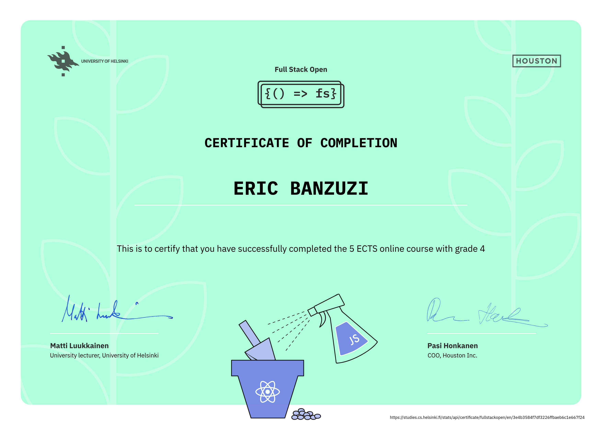

# Full Stack Open 2025

Repository for the assignments in the University of Helsinki Full Stack Open Web Development course.

The course is an introduction to modern web application development with JavaScript. The main focus is on building single page applications with ReactJS that use REST APIs built with Node.js. It covers testing, configuration and environment management, the use of databases for storing the application’s data amongst other things.

## Certificate 

